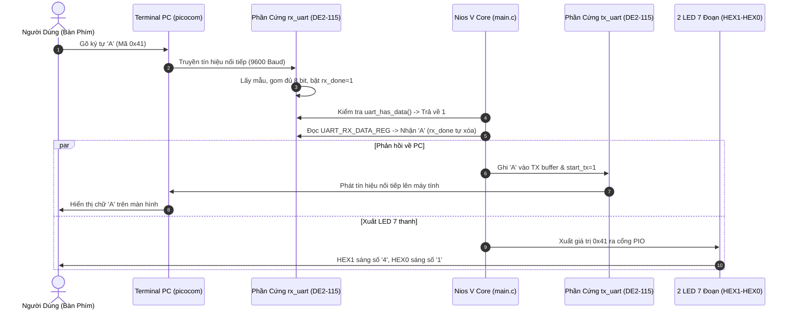

# GIẢI THÍCH CHI TIẾT MÃ NGUỒN C (`main.c`) VÀ CƠ CHẾ APB MASTER TRÊN NIOS V

Tài liệu này giải thích toàn diện và chuẩn xác cách chương trình C trên vi điều khiển **Nios V/c (RISC-V)** điều khiển phần cứng UART, cách CPU hoạt động như một **APB Master** thông qua bus interconnect của FPGA, cùng bản đồ thanh ghi và logic điều khiển hiển thị LED 7 đoạn trên kit **Terasic DE2-115**.

---

## 1. Kiến Trúc Tổng Quan Hệ Thống

Toàn bộ hệ thống giao tiếp được chia làm các tầng phần cứng và phần mềm như sau:

```mermaid
flowchart TD
    subgraph Software ["TẦNG PHẦN MỀM (C Firmware)"]
        APP["main() Loopback & Switch Logic"]
        HAL["IOWR_32DIRECT / IORD_32DIRECT (io.h)"]
        APP --> HAL
    end

    subgraph CPU ["BỘ XỬ LÝ RISC-V"]
        NIOS["Nios V/c Core (RV32I)"]
        AXI_M["AXI4 / Avalon Data Manager"]
        HAL --> NIOS
        NIOS --> AXI_M
    end

    subgraph Interconnect ["BUS INTERCONNECT (Platform Designer)"]
        MERLIN["Merlin Interconnect & APB Bridge"]
        AXI_M -->|Lệnh lw / sw| MERLIN
    end

    subgraph Peripherals ["NGOẠI VI PHẦN CỨNG (FPGA Hardware)"]
        APB_SLAVE["Khối apb_slave (0x00020000)"]
        REGS["Khối uart_regs (Thanh ghi UART)"]
        TX_RX["Module tx_uart / rx_uart"]
        PIO_HEX["Khối pio_0 (0x00010000) -> HEX1-HEX0"]
        PIO_SW["Khối pio_sw (0x00010020) -> SW[7:0]"]
        PIO_KEY["Khối pio_key (0x00010030) -> KEY[1]"]

        MERLIN -->|APB Signals: psel, penable, paddr, pwdata| APB_SLAVE
        MERLIN --> PIO_HEX
        MERLIN --> PIO_SW
        MERLIN --> PIO_KEY

        APB_SLAVE <--> REGS
        REGS <--> TX_RX
    end

    subgraph External ["GIAO TIẾP VẬT LÝ RA NGOÀI"]
        CHIP["Mạch USB-to-UART CP2102/CH340"]
        PC["Máy tính PC (Terminal picocom)"]
        TX_RX <-->|PIN_AB22 (RX) / PIN_AC15 (TX)| CHIP
        CHIP <-->|Dây cáp USB| PC
    end
```

---

## 2. Nios V Hoạt Động Như Một "APB Master" Như Thế Nào?

### 2.1. Khái niệm Master trong kiến trúc Bus
- **Master (Bộ chủ):** Là thành phần duy nhất có quyền chủ động khởi tạo một phiên truyền nhận dữ liệu (Transaction) trên Bus bằng cách phát địa chỉ và các tín hiệu điều khiển đọc/ghi.
- **Slave (Bộ tớ):** Là thành phần bị động, chỉ lắng nghe địa chỉ trên bus và phản hồi dữ liệu khi được Master chọn (`psel = 1`).

Trong hệ thống này, **Nios V Core đóng vai trò là Master**, còn **`apb_uart` đóng vai trò là Slave**.

### 2.2. Cơ chế ánh xạ bộ nhớ (Memory-Mapped I/O - MMIO)
Nios V không có tập lệnh vào/ra riêng biệt như vi xử lý x86 (`in`/`out`). Thay vào đó, toàn bộ các thanh ghi của UART và cổng I/O được gán vào **không gian địa chỉ 32-bit của bộ nhớ**:

| Tên Ngoại Vi | Địa Chỉ Bắt Đầu (Base Address) | Địa Chỉ Kết Thúc | Kích Thước |
| :--- | :--- | :--- | :--- |
| **`onchip_memory2_0`** (RAM chứa code & data) | `0x0000_0000` | `0x0000_FFFF` | 64 KB |
| **`pio_0`** (Điều khiển LED 7 đoạn HEX1-HEX0) | `0x0001_0000` | `0x0001_000F` | 16 Bytes |
| **`pio_sw`** (Đọc 8 công tắc gạt SW[7:0]) | `0x0001_0020` | `0x0001_002F` | 16 Bytes |
| **`pio_key`** (Đọc nút nhấn KEY[1]) | `0x0001_0030` | `0x0001_003F` | 16 Bytes |
| **`apb_uart_0`** (Bộ điều khiển APB UART IP) | `0x0002_0000` | `0x0002_0FFF` | 4 KB |

### 2.3. Quá trình biến đổi từ lệnh C thành chu kỳ bus APB

Khi trong mã nguồn C bạn thực thi lệnh đọc hoặc ghi:

#### A. Chu kỳ Ghi (Write Transaction) - Ví dụ: `IOWR_32DIRECT(UART_CTRL_REG, 0, 0x01)`
1. **Tại CPU RISC-V:**
   - Trình biên dịch dịch lệnh macro `IOWR_32DIRECT` thành lệnh hợp ngữ RISC-V:
     ```assembly
     li   a4, 1            # Nạp giá trị 0x01 vào thanh ghi a4
     lui  a5, 0x20         # a5 = 0x00020000
     addi a5, a5, 12       # a5 = 0x0002000C (Địa chỉ UART_CTRL_REG)
     sw   a4, 0(a5)        # Ghi nội dung a4 vào địa chỉ trong a5
     ```
2. **Tại Merlin Bus Interconnect:**
   - Khi CPU phát lệnh `sw` (Store Word), cổng `data_manager` của Nios V gửi tín hiệu yêu cầu ghi tới bộ giải mã địa chỉ của bus.
   - Bus Interconnect nhận thấy địa chỉ `0x0002000C` thuộc dải của `apb_uart_0` (`0x00020000 - 0x00020FFF`).
   - Cầu chuyển đổi **Merlin APB Translator** chuyển giao tác này thành các tín hiệu bus chuẩn **AMBA APB**:
     - `psel = 1`: Chọn IP APB UART.
     - `penable = 1`: Kích hoạt pha dữ liệu (Access Phase).
     - `pwrite = 1`: Báo hiệu đây là chu kỳ Ghi.
     - `paddr = 12'h00C`: Offset địa chỉ 12-bit (bỏ phần base `0x00020000`).
     - `pwdata = 32'h0000_0001`: Dữ liệu cần ghi.
3. **Tại Khối `apb_slave.v` và `reg_uart.v`:**
   - Khối `apb_slave.v` phát hiện `psel & penable = 1`, lập tức trả về `pready = 1` báo cho CPU biết phần cứng đã tiếp nhận.
   - Khối `reg_uart.v` so khớp `paddr == 12'h00C`, nạp bit `pwdata[0] = 1` vào thanh ghi `ctrl_reg[0]`, tạo xung kích hoạt phát UART (`start_tx = 1`).

#### B. Chu kỳ Đọc (Read Transaction) - Ví dụ: `IORD_32DIRECT(UART_STT_REG, 0)`
1. **Tại CPU RISC-V:**
   - Macro `IORD_32DIRECT` dịch thành lệnh nạp từ bộ nhớ:
     ```assembly
     lui  a5, 0x20         # a5 = 0x00020000
     addi a5, a5, 16       # a5 = 0x00020010 (Địa chỉ UART_STT_REG)
     lw   a0, 0(a5)        # Đọc dữ liệu từ ngoại vi vào thanh ghi a0
     ```
2. **Tại Bus APB:**
   - `psel = 1`, `penable = 1`.
   - `pwrite = 0`: Báo hiệu chu kỳ Đọc.
   - `paddr = 12'h010` (Địa chỉ thanh ghi Status).
3. **Tại Khối `apb_slave.v`:**
   - Lấy giá trị thanh ghi `stt_reg` (chứa các cờ `tx_done`, `rx_done`) nối sang bus `prdata`.
   - Bus Interconnect đưa `prdata` trở lại đường dữ liệu của Nios V để CPU tiếp tục so sánh điều kiện `if ((stt & 0x01) == 0)`.

---

## 3. Bản Đồ Thanh Ghi APB UART (Register Map)

Khối UART IP chiếm giữ không gian 4 KB từ địa chỉ cơ sở `0x00020000`. Cụ thể 5 thanh ghi 32-bit gồm:

| Địa Chỉ Tuyệt Đối | Offset | Tên Thanh Ghi | Truy Cập | Chức Năng Chi Tiết |
| :--- | :--- | :--- | :--- | :--- |
| **`0x00020000`** | `+0x00` | **`UART_TX_DATA_REG`** | Write Only | Ghi byte ký tự cần gửi (8-bit thấp `[7:0]`). |
| **`0x00020004`** | `+0x04` | **`UART_RX_DATA_REG`** | Read Only | Đọc byte ký tự nhận được (`[7:0]`). Khi CPU đọc thanh ghi này, **phần cứng tự động xóa cờ `rx_done` về 0**. |
| **`0x00020008`** | `+0x08` | **`UART_CFG_REG`** | Read / Write | Cấu hình tham số UART:<br>• `[1:0]`: Số data bits (`11` = 8 bits)<br>• `[2]`: Số stop bits (`0` = 1 stop bit)<br>• `[3]`: Cho phép parity (`0` = No parity)<br>• `[4]`: Loại parity (`0` = Even, `1` = Odd)<br>• `[6:5]`: Lựa chọn baudrate (`10` = 9600 baud) |
| **`0x0002000C`** | `+0x0C` | **`UART_CTRL_REG`** | Read / Write | Điều khiển truyền UART:<br>• Bit 0 (`start_tx`): Ghi `1` để bắt đầu phát byte. Phần cứng tự động xóa về `0` sau 1 xung clock. |
| **`0x00020010`** | `+0x10` | **`UART_STT_REG`** | Read Only | Thanh ghi cờ trạng thái:<br>• Bit 0 (`tx_done`): Bằng `1` khi bộ phát rảnh/hoàn thành, bằng `0` khi đang bận gửi.<br>• Bit 1 (`rx_done`): Bằng `1` khi đã nhận trọn vẹn 1 byte mới từ PC.<br>• Bit 2 (`error`): Bằng `1` nếu có lỗi khung (framing) hoặc lỗi parity. |

---

## 4. Giải Thích Chi Tiết Từng Phần Trong Mã Nguồn `main.c`

### 4.1. Khai báo thư viện và định nghĩa địa chỉ

```c
#include <stdint.h>
#include "system.h"
#include "io.h"
#include "altera_avalon_pio_regs.h"

#define APB_UART_0_BASE 0x00020000
#define PIO_0_BASE      0x00010000 // LED 7 đoạn HEX1-HEX0
#define PIO_SW_BASE     0x00010020 // 8 công tắc SW[7:0]
#define PIO_KEY_BASE    0x00010030 // Nút nhấn KEY[1]

#define UART_TX_DATA_REG  (APB_UART_0_BASE + 0x00)
#define UART_RX_DATA_REG  (APB_UART_0_BASE + 0x04)
#define UART_CFG_REG      (APB_UART_0_BASE + 0x08)
#define UART_CTRL_REG     (APB_UART_0_BASE + 0x0C)
#define UART_STT_REG      (APB_UART_0_BASE + 0x10)
```
- Sử dụng các macro chuẩn của Altera HAL (`io.h`): `IOWR_32DIRECT` và `IORD_32DIRECT` để truy cập trực tiếp bộ nhớ theo từ 32-bit (chống tối ưu hóa compiler nhầm lẫn với biến thông thường).

---

### 4.2. Khởi tạo Baudrate và Khung Truyền (`uart_init`)

```c
void uart_init(void) {
    IOWR_32DIRECT(UART_CFG_REG, 0, (0x2 << 5) | 0x3);
}
```
- **Ý nghĩa giá trị cấu hình:**
  - `(0x2 << 5)` $\rightarrow$ dịch số nhị phân `10` vào bit `[6:5]`: Chọn tốc độ **Baud 9600** (khối `baud_gen.v` sẽ chia clock 50 MHz xuống chu kỳ 9600 Hz oversampling x16).
  - `| 0x3` $\rightarrow$ gán giá trị `0b00011` vào các bit thấp:
    - Bit `[1:0] = 2'b11`: Độ dài dữ liệu là **8 data bits**.
    - Bit `[2] = 1'b0`: Sử dụng **1 stop bit**.
    - Bit `[3] = 1'b0`: **Không sử dụng Parity bit**.
  - Tổng thể giá trị ghi xuống: `(0x2 << 5) | 0x3 = 0x43` (`0b0100_0011`).

---

### 4.3. Hàm Gửi Ký Tự Kèm Cơ Chế Timeout An Toàn (`uart_putc`)

```c
int uart_putc(char c) {
    uint32_t timeout = 500000;
    while (((IORD_32DIRECT(UART_STT_REG, 0) & 0x01) == 0) && --timeout);
    if (timeout == 0) return -1; // Chống treo hệ thống nếu phần cứng mất clock

    IOWR_32DIRECT(UART_TX_DATA_REG, 0, (uint32_t)c);
    IOWR_32DIRECT(UART_CTRL_REG, 0, 0x01);
    return 0;
}
```
1. **Kiểm tra trạng thái bộ phát (`tx_done`):**
   - Đọc thanh ghi `UART_STT_REG`. Bit 0 thể hiện cờ `tx_done`.
   - Nếu `(stt & 0x01) == 0`, nghĩa là UART đang bận truyền byte trước đó, CPU sẽ chờ cho đến khi byte truyền xong.
2. **Cơ chế Timeout:**
   - Biến `timeout = 500000` đóng vai trò là "chốt bảo vệ" (Watchdog mềm). Nếu sau 500.000 chu kỳ mà phần cứng không phản hồi, hàm lập tức thoát ra với mã lỗi `-1`, **ngăn chặn tuyệt đối tình trạng CPU bị đóng băng (hang/freeze)**.
3. **Nạp dữ liệu và kích xung phát:**
   - Ghi ký tự `c` vào `UART_TX_DATA_REG`.
   - Ghi `0x01` vào `UART_CTRL_REG` để set `start_tx = 1`. Do trong phần cứng (`reg_uart.v`) đã thiết kế tự động xóa `ctrl_reg[0] <= 1'b0` ở chu kỳ clock kế tiếp, xung phát được đảm bảo độ rộng chính xác 1 chu kỳ clock.

---

### 4.4. Hàm Kiểm Tra và Đọc Ký Tự Nhận Được (`uart_has_data` & `uart_getc`)

```c
int uart_has_data(void) {
    return (IORD_32DIRECT(UART_STT_REG, 0) & 0x02) ? 1 : 0;
}

char uart_getc(void) {
    while (!uart_has_data());
    return (char)(IORD_32DIRECT(UART_RX_DATA_REG, 0) & 0xFF);
}
```
1. **Kiểm tra cờ `rx_done`:**
   - Bit 1 của `UART_STT_REG` là cờ `rx_done`.
   - Khi module `rx_uart.v` nhận đủ 1 frame 10-bit từ PC (Start + 8 Data + Stop), nó kéo `rx_done` lên `1` và lưu dữ liệu vào thanh ghi `rx_data_reg`.
2. **Đọc dữ liệu và Auto-Clear cờ:**
   - Khi CPU gọi `IORD_32DIRECT(UART_RX_DATA_REG, 0)`, trên bus APB sinh ra tín hiệu `reg_pread & (paddr == ADDR_RX)`.
   - Tín hiệu này kích hoạt `rx_read_ack` bên trong `reg_uart.v`, **tự động xóa cờ `rx_done` về 0**, sẵn sàng cho byte kế tiếp mà lập trình viên không cần phải viết thêm thao tác xóa thủ công.

---

### 4.5. Hàm Chính `main()`: Loopback và Điều Khiển Ngoại Vi

```c
int main(void) {
    uart_init();
    IOWR_ALTERA_AVALON_PIO_DATA(PIO_0_BASE, 0x00);
    uart_puts("\r\n=== DE2-115 UART READY ===\r\n");

    uint8_t prev_key1 = 1;

    while (1) {
        // [A] VÒNG LẶP LOOPBACK TỰ ĐỘNG
        if (uart_has_data()) {
            char ch = uart_getc();
            uart_putc(ch);
            IOWR_ALTERA_AVALON_PIO_DATA(PIO_0_BASE, (uint8_t)ch);
        }

        // [B] GỬI KÝ TỰ BẰNG CÔNG TẮC SW[7:0] VÀ NÚT NHẤN KEY[1]
        uint8_t key1 = (uint8_t)(IORD_ALTERA_AVALON_PIO_DATA(PIO_KEY_BASE) & 0x01);
        if (prev_key1 == 1 && key1 == 0) {
            uint8_t sw_val = (uint8_t)(IORD_ALTERA_AVALON_PIO_DATA(PIO_SW_BASE) & 0xFF);
            uart_putc((char)sw_val);
            IOWR_ALTERA_AVALON_PIO_DATA(PIO_0_BASE, sw_val);
            delay_ms(50);
        }
        prev_key1 = key1;
    }
    return 0;
}
```

#### Quá trình hoạt động của vòng lặp:
1. **Khởi động:**
   - Gọi `uart_init()` cấu hình phần cứng.
   - Ghi `0x00` ra `PIO_0_BASE` $\rightarrow$ Bộ giải mã `seven_segment_decoder` trên top-level Verilog nhận `0` và hiển thị hai số **`00`** lên `HEX1` và `HEX0`.
   - Gửi thông điệp chào mừng lên máy tính.
2. **Nhánh [A] - Cơ chế Loopback tức thời:**
   - Khi người dùng gõ 1 ký tự trên terminal PC (ví dụ phím `'A'`, mã ASCII là `0x41`):
     - `uart_has_data()` trả về 1.
     - `uart_getc()` lấy ký tự `'A'`.
     - `uart_putc('A')` gửi ngược ký tự `'A'` trở lại PC $\rightarrow$ Ký tự hiện lên màn hình.
     - `IOWR_ALTERA_AVALON_PIO_DATA(PIO_0_BASE, 0x41)`:
       - 4-bit thấp `0x1` đưa vào `HEX0` $\rightarrow$ Hiện chữ số **`1`**.
       - 4-bit cao `0x4` đưa vào `HEX1` $\rightarrow$ Hiện chữ số **`4`**.
       - Cặp LED 7 thanh hiển thị trọn vẹn số **`41`**.
3. **Nhánh [B] - Truyền dữ liệu từ công tắc Switch:**
   - Người dùng gạt 8 công tắc `SW[7:0]` để chọn 1 byte bất kỳ (ví dụ gạt `0100 0010` = `0x42` là chữ `'B'`).
   - Nhấn nút nhấn `KEY[1]`:
     - Tín hiệu `key1` chuyển từ `1` (nhả) xuống `0` (nhấn) $\rightarrow$ Bắt sườn xuống (`prev_key1 == 1 && key1 == 0`).
     - Đọc giá trị công tắc qua `PIO_SW_BASE`.
     - Phát byte đó lên PC qua `uart_putc()`.
     - Cập nhật số hiển thị lên 2 LED 7 thanh `HEX1-HEX0`.

---

## 5. Giản Đồ Bắt Tay Dữ Liệu (Timing Handshake Diagrams)

### 5.1. Giản đồ gửi ký tự qua bus APB (Nios V ghi vào UART)

```
        __    __    __    __    __    __    __
clk    |  |__|  |__|  |__|  |__|  |__|  |__|  |__
              _____________________
psel   ______|                     |______________
                    _______________
penable ____________|               |______________
              _____________________
pwrite ______|                     |______________
              _____________________
paddr  XXXXXX|       12'h000       |XXXXXXXXXXXXXX  (ADDR_TX)
              _____________________
pwdata XXXXXX|        8'h41        |XXXXXXXXXXXXXX  ('A')
                    _______________
pready _____________|               |______________  (Zero-wait-state)
```

### 5.2. Luồng dữ liệu Loopback toàn diện



---

## 6. Tổng Kết

1. **Hiệu quả của kiến trúc APB Master:**
   - Bằng cách sử dụng bus APB chuẩn kết hợp kiến trúc Zero-Wait-State, việc giao tiếp giữa CPU Nios V và ngoại vi UART diễn ra chỉ trong đúng **1 chu kỳ xung clock** (20 ns ở tần số 50 MHz), giúp hệ thống phản hồi cực nhanh và không bị trễ thời gian chờ bus.
2. **Độ an toàn của phần mềm:**
   - Cơ chế kiểm tra cờ trạng thái kết hợp Timeout bảo vệ giúp chương trình C chạy mượt mà, độc lập và không bao giờ gặp lỗi treo hệ thống.
3. **Tính trực quan phần cứng:**
   - Sự kết hợp giữa bus UART, LED 7 thanh và công tắc ngoại vi biến bộ điều khiển thành một nền tảng SoC hoàn chỉnh, vừa tương tác máy tính vừa tương tác người dùng trên bo mạch DE2-115.
