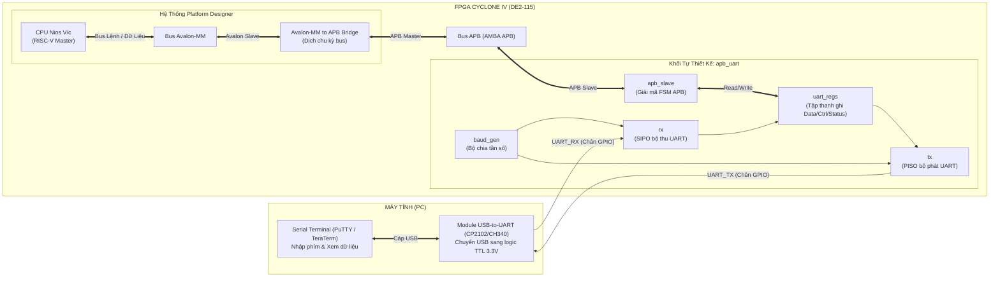

# Hướng Dẫn Tích Hợp Hệ Thống Truyền Nhận UART 2 Chiều: Nios V (RISC-V) $\leftrightarrow$ APB Bridge $\leftrightarrow$ APB UART $\leftrightarrow$ PC

Tài liệu này được biên soạn chuẩn xác theo đúng sơ đồ kiến trúc (spec) của bạn, giải thích tường tận bản chất từng khối IP và hướng dẫn từng bước cụ thể từ phần cứng Verilog, cấu hình Qsys/Platform Designer đến lập trình C trên kit **DE2-115 (Cyclone IV EP4CE115)**.

---

## 1. Sơ Đồ Kiến Trúc Toàn Hệ Thống

Dựa trên đúng mô hình kiến trúc của bạn, toàn bộ hệ thống chia làm 2 phần chính: **FPGA (DE2-115)** và **PC (Máy tính)**:



---

## 2. Bản Chất & Nguyên Lý Hoạt Động Tường Tận Của Từng IP Block

Để nắm chắc bản chất thiết kế SoC (System-on-Chip), bạn cần hiểu rõ tại sao lại có từng khối này và dữ liệu chạy qua chúng như thế nào:

### 2.1. Khối PC & USB2UART (Giao tiếp vật lý ngoài)
* **Tại sao không cắm thẳng cổng USB vào chân FPGA?** 
  Cổng USB truyền dữ liệu bằng các gói tin vi sai phức tạp (D+/D-), tốc độ cao. Trong khi đó, module UART tự thiết kế trên FPGA nhận dữ liệu nối tiếp mức logic TTL (3.3V).
* **Vai trò của USB2UART**: Đóng vai trò cầu nối phần cứng. Khi máy tính gửi 1 ký tự `'A'` (mã ASCII `0x41`), module USB2UART chuyển nó thành tín hiệu xung điện áp nối tiếp trên dây `TX` đưa vào chân FPGA.

---

### 2.2. Khối Lõi UART Controller (`rx`, `tx`, `baud_gen`)
* **`baud_gen` (Tạo nhịp tốc độ truyền)**:
  * Kit DE2-115 có clock gốc là **50 MHz** (50.000.000 chu kỳ/giây).
  * Chuẩn UART chạy ở các tốc độ định trước như **9600 bps** (9600 bit/giây) hoặc **115200 bps**.
  * `baud_gen` là một bộ đếm chia tần số: $Max\_Count = \frac{50.000.000}{Baudrate \times 16}$ (dùng oversampling 16x để lấy mẫu tín hiệu RX tại điểm giữa bit, chống méo dạng tín hiệu).
* **`rx` (Bộ nhận dữ liệu nối tiếp)**:
  * Tín hiệu từ bên ngoài đi vào chân FPGA là tín hiệu bất đồng bộ. Khối `rx` dùng **2 D-Flip-Flop** để khử hiện tượng bất định mức áp (Metastability).
  * Chờ Start bit (`0`) $\rightarrow$ lấy mẫu 8 data bits $\rightarrow$ kiểm tra Parity (nếu bật) $\rightarrow$ kiểm tra Stop bit (`1`).
  * Khi nhận trọn vẹn 1 byte, kích cờ `rx_done = 1` và đẩy dữ liệu vào `rx_data[7:0]`.
* **`tx` (Bộ phát dữ liệu nối tiếp)**:
  * Khi nhận lệnh phát (`send = 1`), bộ `tx` nạp byte dữ liệu vào thanh ghi dịch PISO (Parallel-In Serial-Out).
  * Tự động phát ra Start bit (`0`) $\rightarrow$ đẩy lần lượt 8 data bits $\rightarrow$ phát Parity $\rightarrow$ kết thúc bằng Stop bit (`1`) ra chân `data_tx`.

---

### 2.3. Khối `uart_regs` (Tập thanh ghi ánh xạ bộ nhớ - Memory-Mapped Registers)
CPU không thể điều khiển trực tiếp từng dây tín hiệu logic tốc độ cao của UART. Do đó, cần có các thanh ghi trung gian làm "hộp thư":
* **Địa chỉ `0x00` (`TX_DATA_REG`)**: CPU ghi byte cần gửi vào đây.
* **Địa chỉ `0x04` (`RX_DATA_REG`)**: CPU đọc byte vừa nhận được từ PC.
* **Địa chỉ `0x08` (`CFG_REG`)**: Cấu hình tốc độ Baud (9600/115200), số data bit, số stop bit, parity.
* **Địa chỉ `0x0C` (`CTRL_REG`)**: Thanh ghi điều khiển (bit 0 = `start_tx` để ra lệnh phát).
* **Địa chỉ `0x10` (`STT_REG`)**: Thanh ghi trạng thái (bit 0 = `tx_done`, bit 1 = `rx_done`, bit 2 = `error`). CPU đọc thanh ghi này để biết khi nào có dữ liệu mới đến hoặc khi nào bộ phát đã gửi xong.

---

### 2.4. Khối `apb_slave` & Chuẩn Bus AMBA APB
* **Tại sao lại dùng bus APB?**
  Chuẩn bus **APB (Advanced Peripheral Bus)** của ARM được thiết kế riêng cho các ngoại vi đơn giản, tiêu thụ ít năng lượng và không yêu cầu tốc độ đường ống (non-pipelined).
* **Giao thức APB chỉ có 2 pha**:
  1. **Setup Phase**: Master kéo `PSEL = 1`, `PENABLE = 0`, đặt địa chỉ `PADDR` và dữ liệu `PWDATA`.
  2. **Access Phase**: Master kéo `PENABLE = 1`. Khi `PREADY = 1`, dữ liệu được truyền xong và kết thúc chu kỳ.
* Khối `apb_slave` của bạn chính là một FSM nhận các tín hiệu này để sinh ra xung `write_en` và `read_en` kích hoạt `uart_regs`.

---

### 2.5. Khối `Avalon-MM to APB Bridge` (Trọng tâm câu hỏi của bạn)
* **Tại sao BẮT BUỘC phải có Bridge?**
  * CPU trên FPGA của Altera/Intel là **Nios V**, và ngôn ngữ bus "mẹ đẻ" của Nios V trong Platform Designer là **Avalon-MM**.
  * Avalon-MM dùng các tín hiệu như `waitrequest`, `read`, `write`, `byteenable`.
  * Khối UART của bạn lại nói ngôn ngữ **APB** (`psel`, `penable`, `pwrite`, `pready`).
  * Hai chuẩn này **không thể cắm dây trực tiếp vào nhau**!
* **Nhiệm vụ của Bridge**:
  * Đóng vai trò là "Người phiên dịch":
    * Về phía Nios V: Bridge là một **Avalon-MM Slave**.
    * Về phía APB UART: Bridge là một **APB Master**.
  * Khi CPU Nios V thực hiện lệnh ghi trong C (`IOWR_32DIRECT(BASE, 0, 'A')`):
    1. CPU gửi tín hiệu Avalon: `write = 1`, `address = 0x00`, `writedata = 'A'`.
    2. Bridge bắt lấy tín hiệu này, giữ chân CPU lại bằng `waitrequest = 1`.
    3. Bridge tạo chu kỳ APB: kéo `PSEL = 1`, `PENABLE = 0` (Setup Phase), chu kỳ sau kéo `PENABLE = 1` (Access Phase).
    4. Khối `apb_slave` của bạn nhận được dữ liệu và trả về `PREADY = 1`.
    5. Bridge nhận được `PREADY = 1`, lập tức nhả `waitrequest = 0` báo cho CPU Nios V biết việc ghi đã hoàn tất!

---

### 2.6. Khối CPU Nios V/c (RISC-V Processor)
* Đóng vai trò là **Bộ não trung tâm (Master)**.
* Chạy chương trình viết bằng C.
* Nhờ cơ chế Memory-Mapped I/O, CPU đọc/ghi các thanh ghi của UART hoàn toàn giống như đọc/ghi một biến trong bộ nhớ RAM qua con trỏ địa chỉ.

---

## 3. Các Bước Tiếp Theo Bạn Cần Làm (Chi Tiết Từng Bước)

Bạn đã có sẵn các khối con (`apb.v`, `reg_uart.v`, `tx_uart.v`, `rx_uart.v`, `rx_baud_gen.v`). Dưới đây là lộ trình chính xác để hoàn thiện toàn bộ hệ thống:

```
[Bước 1: Ghép khối Top apb_uart.v]
               │
               ▼
[Bước 2: Tạo Hệ Thống CPU & APB Bridge trong Platform Designer]
               │
               ▼
[Bước 3: Ghép Top-level Verilog & Gán Chân DE2-115]
               │
               ▼
[Bước 4: Viết Chương Trình C Truyền Nhận 2 Chiều]
               │
               ▼
[Bước 5: Nạp FPGA & Mở Terminal Trên PC Để Test]
```

---

### Bước 1: Tạo Module Wrapper `apb_uart.v`

Hãy gom tất cả các file con thành một module duy nhất tên là `apb_uart.v`. File này sẽ nối các dây bên trong, chỉ đưa ra ngoài:
1. Giao diện bus **APB Slave**: `pclk`, `preset_n`, `paddr`, `psel`, `penable`, `pwrite`, `pwdata`, `prdata`, `pready`, `pslverr`.
2. Hai chân vật lý ra thế giới thực: `uart_rx` (nhận từ PC) và `uart_tx` (gửi về PC).

Tạo file [`rtl/apb_uart.v`](file:///home/vietanh/Downloads/code/UART/UART/rtl/apb_uart.v) với nội dung:

```verilog
module apb_uart #(
    parameter CLK_FREQ = 50_000_000
)(
    // Giao diện APB Bus
    input  wire        pclk,
    input  wire        preset_n,
    input  wire        psel,
    input  wire        penable,
    input  wire        pwrite,
    input  wire [11:0] paddr,
    input  wire [31:0] pwdata,
    output wire        pready,
    output wire        pslverr,
    output wire [31:0] prdata,

    // Chân ngoại vi UART vật lý nối ra ngoài
    input  wire        uart_rx,
    output wire        uart_tx
);

    // Dây nối nội bộ giữa apb_slave và uart_regs
    wire [11:0] reg_paddr;
    wire [31:0] reg_pwdata;
    wire        reg_pwrite;
    wire        write_en;
    wire        read_en;
    wire [31:0] reg_prdata;

    // Dây nối giữa uart_regs và bộ phát (TX)
    wire [31:0] tx_data;
    wire        start_tx;
    wire [1:0]  baud_sel;
    wire [1:0]  data_bit_num;
    wire        stop_bit_num;
    wire        parity_en;
    wire        parity_type;
    wire        tx_active;
    wire        tx_done;

    // Dây nối giữa bộ thu (RX) và uart_regs
    wire [31:0] rx_data;
    wire        rx_done;
    wire        rx_error;
    wire        rx_baud_tick;

    // 1. Khởi tạo apb_slave
    apb_slave u_apb_slave (
        .pclk      (pclk),
        .preset_n  (preset_n),
        .psel      (psel),
        .penable   (penable),
        .pwrite    (pwrite),
        .paddr     (paddr),
        .pwdata    (pwdata),
        .pready    (pready),
        .pslverr   (pslverr),
        .prdata    (prdata),
        .reg_paddr (reg_paddr),
        .reg_pwdata(reg_pwdata),
        .reg_pwrite(reg_pwrite),
        .write_en  (write_en),
        .read_en   (read_en),
        .reg_prdata(reg_prdata)
    );

    // tx_done tích cực mức cao khi bộ phát rảnh rỗi (không còn active)
    assign tx_done = ~tx_active;

    // 2. Khởi tạo uart_regs
    uart_regs u_uart_regs (
        .clk         (pclk),
        .rst_n       (preset_n),
        .paddr       (reg_paddr),
        .pwdata      (reg_pwdata),
        .pwrite      (reg_pwrite),
        .write_en    (write_en),
        .read_en     (read_en),
        .prdata      (reg_prdata),
        .tx_data     (tx_data),
        .data_bit_num(data_bit_num),
        .stop_bit_num(stop_bit_num),
        .parity_en   (parity_en),
        .parity_type (parity_type),
        .start_tx    (start_tx),
        .baud_sel    (baud_sel),
        .tx_done     (tx_done),
        .rx_done     (rx_done),
        .error       (rx_error),
        .rx_data     (rx_data)
    );

    // 3. Bộ phát UART TX
    tx_uart #(
        .CLK_FREQ(CLK_FREQ)
    ) u_tx_uart (
        .send       (start_tx),
        .baud_rate  (baud_sel),
        .clk        (pclk),
        .rst_n      (preset_n),
        .data_in    (tx_data[7:0]),
        .parity_type({1'b0, parity_type}),
        .active     (tx_active),
        .data_tx    (uart_tx)
    );

    // 4. Bộ tạo Baud cho RX (Oversampling 16x)
    rx_baud_gen #(
        .CLK_FREQ(CLK_FREQ)
    ) u_rx_baud_gen (
        .baud_rate(baud_sel),
        .clk      (pclk),
        .rst_n    (preset_n),
        .baud_en  (rx_baud_tick)
    );

    // 5. Bộ thu UART RX
    rx_uart u_rx_uart (
        .clk        (pclk),
        .rst_n      (preset_n),
        .rx         (uart_rx),
        .baud_tick  (rx_baud_tick),
        .data_b_num (data_bit_num),
        .stop_b_num (stop_bit_num),
        .parity_type({1'b0, parity_type}),
        .parity_en  (parity_en),
        .rx_data    (rx_data),
        .rx_done    (rx_done),
        .error      (rx_error)
    );

endmodule
```

---

### Bước 2: Tích Hợp CPU Nios V & APB Bridge Trong Platform Designer

Để tạo khối CPU và APB Bridge theo đúng sơ đồ, cách thực hiện chuẩn hóa nhất trong Platform Designer (Qsys) như sau:

#### Phương án tối ưu nhất (Đóng gói `apb_uart` thành IP Component):
Platform Designer của Intel **hỗ trợ chuẩn APB nguyên bản**. Khi bạn thêm một IP có cổng APB Slave, Platform Designer sẽ **tự động sinh ra khối Avalon-MM to APB Bridge** ở giữa:

1. Mở **Platform Designer** (mở file `system.qsys` đã tạo trước đó).
2. Vào menu **File** $\rightarrow$ chọn **New Component...**:
   * **Tab Component Type**: Đặt tên IP là `apb_uart`.
   * **Tab Files**: Nhấn **Add File...** $\rightarrow$ chọn file `rtl/apb_uart.v` và tất cả các file trong thư mục `rtl/` $\rightarrow$ bấm **Analyze Synthesis Files** (chờ báo phân tích thành công).
   * **Tab Signals & Interfaces**:
     * Tìm interface bus của IP, đổi tên thành `apb_slave`, chọn kiểu **`APB Slave`**.
     * Gán đúng các tín hiệu: `paddr` $\rightarrow$ PADDR, `psel` $\rightarrow$ PSEL, `penable` $\rightarrow$ PENABLE, `pwrite` $\rightarrow$ PWRITE, `pwdata` $\rightarrow$ PWDATA, `prdata` $\rightarrow$ PRDATA, `pready` $\rightarrow$ PREADY, `pslverr` $\rightarrow$ PSLVERR.
     * Tìm 2 tín hiệu `uart_rx` và `uart_tx`: Gom vào 1 interface mới kiểu **`Conduit`**, đặt tên là `conduit_uart`.
   * Bấm **Finish** để lưu IP vào thư viện.
3. **Thêm IP vào hệ thống Platform Designer**:
   * Tại ô tìm kiếm IP Catalog bên trái, tìm `apb_uart` vừa tạo $\rightarrow$ bấm **Add**.
   * **Nối dây**:
     * Nối clock `clk` và `reset` từ `clk_0`.
     * Cột **Connections**: Nối từ **`data_manager` của Nios V/c** sang cổng **`apb_slave` của `apb_uart`** (Platform Designer sẽ tự động chèn Bridge chuyển đổi Avalon $\leftrightarrow$ APB).
     * Cột **Export**: Click đúp vào dòng `conduit_uart` để xuất chân ra ngoài, đặt tên là `uart_external`.
4. **Gán địa chỉ**:
   * Vào menu **System** $\rightarrow$ chọn **Assign Base Addresses**.
   * Bạn sẽ thấy `apb_uart` nhận một địa chỉ cơ sở, ví dụ: **`0x0002_0000`**.
5. Bấm **Generate HDL...** $\rightarrow$ bấm **Generate** $\rightarrow$ đóng Platform Designer.

---

### Bước 3: Ghép File Top-Level Verilog & Gán Chân Trên Kit DE2-115

#### 1. Cập nhật file Top-Level Verilog (`NIOS.v`):
```verilog
module NIOS (
    input  wire       CLOCK_50,   // Clock 50MHz trên kit (PIN_Y2)
    input  wire [0:0] KEY,        // Nút nhấn KEY0 làm Reset (PIN_M23)
    output wire [7:0] LEDG,       // 8 LED xanh lá cây hiển thị trạng thái
    
    // 2 Chân giao tiếp UART với module USB2UART ngoài
    input  wire       UART_RXD,   // Nhận dữ liệu từ TX của module USB2UART
    output wire       UART_TXD    // Gửi dữ liệu sang RX của module USB2UART
);

    // Khởi tạo hệ thống SoC từ Platform Designer
    system u0 (
        .clk_clk                         (CLOCK_50),
        .reset_reset_n                   (KEY[0]),
        .pio_0_external_connection_export(LEDG),
        
        // 2 chân ngoại vi UART vừa export
        .uart_external_uart_rx           (UART_RXD),
        .uart_external_uart_tx           (UART_TXD)
    );

endmodule
```

#### 2. Gán chân vật lý trong Quartus (Pin Planner):
Để nối dây từ kit DE2-115 sang module USB-to-UART ngoài, bạn dùng 2 chân bất kỳ trên hàng chân mở rộng **JP5 (GPIO Header)**:

| Tín Hiệu | Chân FPGA trên DE2-115 | Vị Trí Vật Lý Trên Kit DE2-115 | Nối Với Chân Mạch USB2UART Ngoài |
| :--- | :--- | :--- | :--- |
| **`UART_RXD`** | **`PIN_AB22`** | Chân 1 của Header `GPIO` (JP5) | Nối vào chân **TX** của mạch USB2UART |
| **`UART_TXD`** | **`PIN_AC15`** | Chân 2 của Header `GPIO` (JP5) | Nối vào chân **RX** của mạch USB2UART |
| **`GND`** | **Chân GND của JP5** | Chân 12 hoặc chân GND trên DE2-115 | Nối vào chân **GND** của mạch USB2UART |

> [!IMPORTANT]
> **Quy tắc đấu dây UART**:
> 1. **Bắt buộc chéo dây**: TX bên này cắm vào RX bên kia và ngược lại!
> 2. **Chung Mass (GND)**: Bắt buộc phải cắm 1 dây từ chân GND của mạch USB2UART sang chân GND của kit DE2-115 để 2 thiết bị có chung điện áp tham chiếu.

---

### Bước 4: Viết Mã Nguồn C Trên Nios V (Software Truyền Nhận 2 Chiều)

Mở file [`software/main.c`](file:///home/vietanh/altera_lite/24.1std/software/main.c) và thay bằng chương trình test truyền nhận 2 chiều (Echo test):

```c
#include <stdio.h>
#include <stdint.h>
#include <unistd.h>
#include "system.h"
#include "io.h"
#include "altera_avalon_pio_regs.h"

// Địa chỉ Base của module APB UART (kiểm tra trong system.h)
#ifndef APB_UART_BASE
#define APB_UART_BASE 0x00020000
#endif

// Offset các thanh ghi theo đúng định nghĩa trong reg_uart.v
#define UART_TX_DATA_REG  (APB_UART_BASE + 0x00)
#define UART_RX_DATA_REG  (APB_UART_BASE + 0x04)
#define UART_CFG_REG      (APB_UART_BASE + 0x08)
#define UART_CTRL_REG     (APB_UART_BASE + 0x0C)
#define UART_STT_REG      (APB_UART_BASE + 0x10)

// Khởi tạo UART: Baud 9600 (baud_sel = 2'b10), 8 data bits, 1 stop bit, no parity
void uart_init(void) {
    // cfg_reg: baud_sel[6:5] = 2'b10 (9600), data_bits[1:0] = 2'b11 (8 bit)
    uint32_t cfg_val = (0x2 << 5) | (0x3); 
    IOWR_32DIRECT(UART_CFG_REG, 0, cfg_val);
}

// Gửi 1 ký tự ra UART
void uart_putc(char c) {
    // 1. Chờ cho tới khi bộ phát rảnh (tx_done = bit 0 của stt_reg = 1)
    while ((IORD_32DIRECT(UART_STT_REG, 0) & 0x01) == 0);

    // 2. Ghi ký tự vào TX_DATA_REG
    IOWR_32DIRECT(UART_TX_DATA_REG, 0, (uint32_t)c);

    // 3. Kích xung start_tx (bit 0 của ctrl_reg = 1 rồi về 0)
    IOWR_32DIRECT(UART_CTRL_REG, 0, 0x01);
    IOWR_32DIRECT(UART_CTRL_REG, 0, 0x00);
}

// Gửi một chuỗi ký tự
void uart_puts(const char *str) {
    while (*str) {
        uart_putc(*str++);
    }
}

// Kiểm tra xem có dữ liệu gửi từ PC đến chưa
int uart_has_data(void) {
    // rx_done là bit 1 của STT_REG
    return (IORD_32DIRECT(UART_STT_REG, 0) & 0x02) ? 1 : 0;
}

// Đọc 1 ký tự nhận được
char uart_getc(void) {
    // Chờ cho đến khi rx_done = 1
    while (!uart_has_data());
    // Đọc byte từ RX_DATA_REG
    return (char)(IORD_32DIRECT(UART_RX_DATA_REG, 0) & 0xFF);
}

int main(void) {
    uart_init();
    
    // In thông báo chào mừng ra cả JTAG UART (màn hình nios shell) và APB UART (PC)
    printf("=== HE THONG NIOS V + APB UART DA KHOI DONG ===\n");
    uart_puts("\r\n=========================================\r\n");
    uart_puts(" Chao PC! Toi la Nios V tren FPGA DE2-115 \r\n");
    uart_puts(" Hay go phim, toi se phan hoi lai ngay!  \r\n");
    uart_puts("=========================================\r\n");

    int rx_counter = 0;

    while (1) {
        // Nếu có ký tự gửi từ PC
        if (uart_has_data()) {
            char ch = uart_getc();
            rx_counter++;

            // Hiển thị số lượng ký tự nhận được ra 8 LED xanh
            IOWR_ALTERA_AVALON_PIO_DATA(PIO_0_BASE, rx_counter);

            // Gửi phản hồi 2 chiều về lại PC (Echo)
            uart_puts("[DE2 Echo]: Ban vua gui ky tu '");
            uart_putc(ch);
            uart_puts("'\r\n");

            // Log ra terminal nội bộ
            printf("Nhan duoc tu PC: %c (Tong so: %d)\n", ch, rx_counter);
        }
    }

    return 0;
}
```

---

### Bước 5: Nạp Xuống FPGA Và Kiểm Tra Kết Quả Trên PC

#### 1. Biên dịch và nạp xuống kit:
Chạy script tự động đã tạo sẵn:
```bash
cd ~/altera_lite/24.1std
./run_all.sh
```

#### 2. Mở phần mềm kết nối trên PC:
* Cắm mạch USB-to-UART vào máy tính (ví dụ nhận cổng `COM3` trên Windows hoặc `/dev/ttyUSB0` trên Linux).
* Mở phần mềm **PuTTY** hoặc **TeraTerm** (hoặc Arduino Serial Monitor):
  * **Connection Type**: Serial
  * **Serial Port**: Cổng COM tương ứng
  * **Speed (Baud rate)**: `9600`
  * **Data bits**: `8`, **Stop bits**: `1`, **Parity**: `None`
* **Kết quả**:
  1. Ngay khi mở cổng, màn hình PC hiện thông báo:
     ```text
     =========================================
      Chao PC! Toi la Nios V tren FPGA DE2-115 
      Hay go phim, toi se phan hoi lai ngay!  
     =========================================
     ```
  2. Bạn gõ phím `'h'`, PC lập tức nhận lại:
     ```text
     [DE2 Echo]: Ban vua gui ky tu 'h'
     ```
  3. Đồng thời trên board DE2-115, 8 đèn LED xanh tăng giá trị đếm nhị phân tương ứng với mỗi ký tự bạn gõ!

---

## 4. Bảng Kiểm Tra Nhanh (Troubleshooting Checklist)

| Hiện tượng | Nguyên nhân phổ biến | Cách khắc phục |
| :--- | :--- | :--- |
| **PC không nhận được chữ nào** | 1. Cắm nhầm TX/RX<br/>2. Chưa nối chung chân GND | 1. Đảo chéo lại 2 dây TX và RX.<br/>2. Bắt buộc cắm 1 dây nối chân GND của mạch USB sang GND kit DE2. |
| **Nhận về ký tự lạ / rác (``)** | Tốc độ Baud giữa PC và FPGA không khớp | Đảm bảo cả trong code C (`uart_init`) và phần mềm trên PC đều chọn đúng `9600`. |
| **Gửi được nhưng không nhận được** | Quên nối hoặc sai chân `UART_RXD` trên Pin Planner | Kiểm tra lại vị trí chân GPIO trong Pin Planner xem đã map đúng `PIN_AB22` chưa. |
