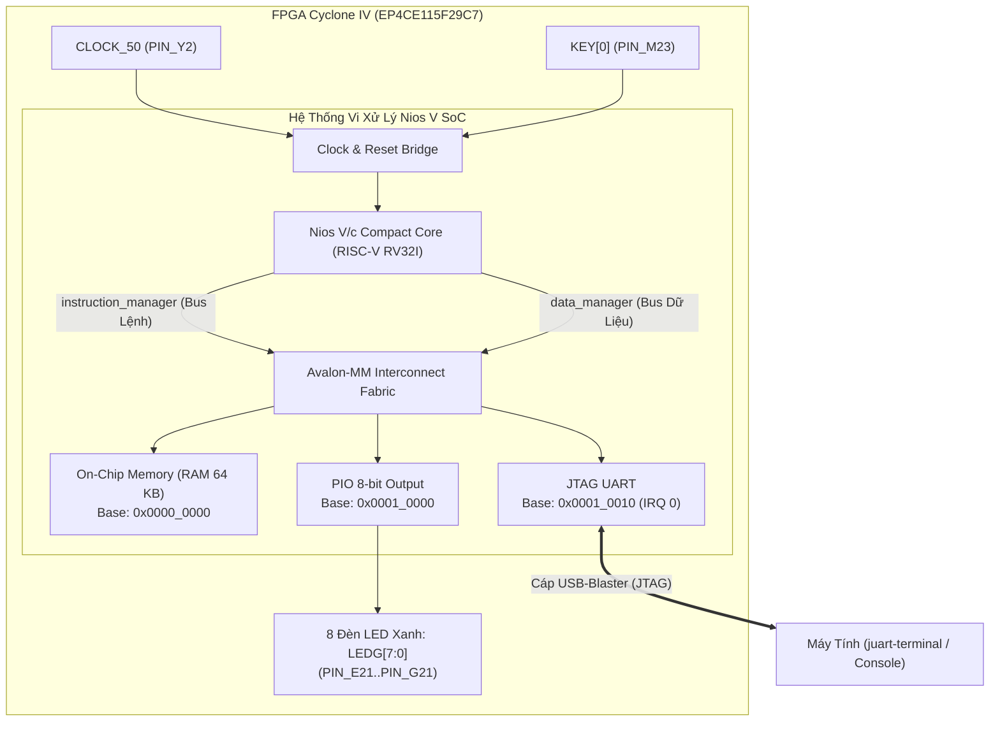

# Sổ Tay Vận Hành & Kiến Trúc Hệ Thống Nios V (RISC-V) Trên FPGA DE2-115

Tài liệu này cung cấp cái nhìn tổng quan toàn diện nhất về kiến trúc hệ thống vi xử lý **Nios V/c (RISC-V)** được xây dựng trên kit **Terasic DE2-115 (Altera Cyclone IV EP4CE115)** cùng quy trình vận hành, chỉnh sửa phần mềm và theo dõi kết quả.

---

## 1. Sơ Đồ Kiến Trúc Hệ Thống Tổng Thể

Hệ thống được thiết kế theo mô hình **System-on-Chip (SoC)** trong FPGA sử dụng chuẩn bus nội bộ **Avalon-MM**:



---

## 2. Bản Chất Luồng Hoạt Động Của Nios V/c

### Tại sao không dùng `niosv-download` / OpenOCD?
* Lõi **Nios V/c (Compact)** là phiên bản vi xử lý mã nguồn mở RISC-V tối giản, **miễn phí hoàn toàn** trên bản Quartus Lite (không yêu cầu license trả phí).
* Để tiết kiệm diện tích logic, Intel đã **tắt cứng Debug Module** (`debugEnabled = false`). Vì không có module JTAG Debug phần cứng, các công cụ như `niosv-download` hay OpenOCD không thể "bắt" CPU dừng lại để nạp code qua JTAG như Nios II cũ.

### Cơ chế chạy mã C tối ưu (RAM Initialization):
Thay vì nạp phần mềm động qua JTAG, hệ thống sử dụng quy trình chuẩn của vi điều khiển nhúng trên FPGA:
1. **Biên dịch C**: Mã nguồn [`software/main.c`](file:///home/vietanh/altera_lite/24.1std/software/main.c) được trình biên dịch `riscv-none-elf-gcc` dịch thành file nhị phân mã máy [`software/build/onchip_memory2_0.hex`](file:///home/vietanh/altera_lite/24.1std/software/build/onchip_memory2_0.hex).
2. **Nhúng vào FPGA bitstream**: Lệnh `quartus_cdb --update_mif` và `quartus_asm` cập nhật trực tiếp nội dung bộ nhớ RAM trong file [`output_files/NIOS.sof`](file:///home/vietanh/altera_lite/24.1std/output_files/NIOS.sof) (quá trình này chỉ mất **3-4 giây**, không cần tổng hợp lại toàn bộ phần cứng).
3. **Thực thi**: Khi nạp file `.sof` vào board DE2-115, CPU Nios V/c tự động khởi động ngay từ địa chỉ `0x0000_0000` và chạy code C lập tức.
4. **Giao tiếp Console**: CPU gửi dữ liệu qua module **JTAG UART**, máy tính bắt tín hiệu và hiển thị lên màn hình bằng lệnh `juart-terminal`.

---

## 3. Bảng Phân Bổ Bộ Nhớ & Gán Chân Phần Cứng

### Bảng phân bổ bộ nhớ (Address Map):
| Ngoại Vi | Địa Chỉ Bắt Đầu (Base) | Kích Thước | Cổng Kết Nối CPU | Chức Năng |
| :--- | :--- | :--- | :--- | :--- |
| **`onchip_memory2_0`** | `0x0000_0000` | 64 KB | `instruction_manager` & `data_manager` | Chứa mã chương trình C, biến toàn cục, Stack & Heap |
| **`pio_0`** | `0x0001_0000` | 16 Bytes | `data_manager` | Ghi dữ liệu 8-bit xuất ra 8 LED xanh |
| **`jtag_uart_0`** | `0x0001_0010` | 8 Bytes | `data_manager` (IRQ 0) | Cổng truyền/nhận chuỗi ký tự với terminal máy tính |

### Bảng gán chân vật lý trên kit DE2-115 (Pin Assignments):
| Tín Hiệu | Chân FPGA (Location) | I/O Standard | Chú Thích Vật Lý Trên Kit DE2-115 |
| :--- | :--- | :--- | :--- |
| `CLOCK_50` | **`PIN_Y2`** | 3.3-V LVTTL | Bộ dao động 50MHz onboard |
| `KEY[0]` | **`PIN_M23`** | 3.3-V LVTTL | Nút nhấn KEY0 (Tín hiệu Reset - tích cực mức thấp) |
| `LEDG[0]` | **`PIN_E21`** | 2.5 V | Đèn LED xanh lá 0 |
| `LEDG[1]` | **`PIN_E22`** | 2.5 V | Đèn LED xanh lá 1 |
| `LEDG[2]` | **`PIN_E25`** | 2.5 V | Đèn LED xanh lá 2 |
| `LEDG[3]` | **`PIN_E24`** | 2.5 V | Đèn LED xanh lá 3 |
| `LEDG[4]` | **`PIN_H21`** | 2.5 V | Đèn LED xanh lá 4 |
| `LEDG[5]` | **`PIN_G20`** | 2.5 V | Đèn LED xanh lá 5 |
| `LEDG[6]` | **`PIN_G22`** | 2.5 V | Đèn LED xanh lá 6 |
| `LEDG[7]` | **`PIN_G21`** | 2.5 V | Đèn LED xanh lá 7 |

---

## 4. Hướng Dẫn Vận Hành (Thao Tác Thực Tế)

Thư mục chính chứa project và các script: `/home/vietanh/altera_lite/24.1std`

### Bước 1: Kết nối phần cứng
1. Cắm nguồn adapter 12V DC cho kit DE2-115.
2. Cắm cáp USB vào cổng **USB-Blaster** trên kit nối tới cổng USB máy tính.
3. Bật công tắc nguồn màu đỏ (**POWER switch**).

### Bước 2: Chạy toàn bộ hệ thống (1 Lệnh duy nhất)
Mở cửa sổ Terminal trên máy tính và gõ:

```bash
cd ~/altera_lite/24.1std
./run_all.sh
```

**Kịch bản tự động thực hiện:**
1. Biên dịch file C [`software/main.c`](file:///home/vietanh/altera_lite/24.1std/software/main.c).
2. Cập nhật mã máy vào bitstream `.sof` (~3 giây).
3. Nạp xuống kit FPGA DE2-115 (~5 giây).
4. Tự động mở `juart-terminal` đón log in ra màn hình.

*(Nhấn tổ hợp phím **Ctrl + C** bất kỳ lúc nào để thoát khỏi giao diện terminal).*

---

## 5. Xem Và Sửa Đổi Chương Trình C

Mã nguồn điều khiển nằm tại: **[`software/main.c`](file:///home/vietanh/altera_lite/24.1std/software/main.c)**

```c
#include <stdio.h>
#include <unistd.h>
#include "system.h"
#include "altera_avalon_pio_regs.h"

int main(void) {
    int counter = 0;
    printf("\n=== HE THONG NIOS V KHOI DONG THANH CONG ===\n");

    while (1) {
        // 1. In dữ liệu ra màn hình terminal qua JTAG UART
        printf("FPGA dang chay! Gia tri dem: %d\n", counter);

        // 2. Xuất biến đếm ra 8 LED xanh lá cây
        IOWR_ALTERA_AVALON_PIO_DATA(PIO_0_BASE, counter);

        counter++;
        if (counter > 255) counter = 0;

        // 3. Delay 500.000 micro-giây (0.5 giây)
        usleep(500000);
    }

    return 0;
}
```

* Để mở sửa code: `gedit ~/altera_lite/24.1std/software/main.c &` hoặc dùng VS Code.
* Sau khi lưu code, chỉ cần chạy lại `./run_all.sh` là chương trình mới sẽ chạy ngay trên kit trong vòng **10 giây**.

---

## 6. Mở Rộng: Kết Nối Nios V Với Ngoại Vi Chuẩn APB (ARM AMBA)

Nếu bạn có các khối IP ngoại vi tự viết theo chuẩn bus **APB**:
* **Không cần sửa CPU**: Nios V giữ nguyên vai trò Master (Avalon-MM hoặc AXI4-Lite).
* **Platform Designer hỗ trợ APB nguyên bản**: Khi đóng gói IP vào Qsys, chọn Interface Type là **`APB Slave`**.
* Kéo dây từ `data_manager` của Nios V sang cổng `apb_slave` của IP. Bộ ghép bus tự động (**`altera_merlin_apb_translator`**) sẽ tự động chuyển đổi chu kỳ bus mà không cần thêm code glue logic.
* Trong C, truy cập thanh ghi APB bằng hàm:
  ```c
  #define MY_APB_BASE 0x00020000
  IOWR_32DIRECT(MY_APB_BASE, 0, value); // Ghi
  uint32_t val = IORD_32DIRECT(MY_APB_BASE, 0); // Đọc
  ```

---

## 7. Các Script Hỗ Trợ Đã Được Chuẩn Bị Sẵn

| Tên Script | Công Dụng |
| :--- | :--- |
| **`./run_all.sh`** *(hoặc `./build_and_run.sh`)* | Tự động build C $\rightarrow$ Update RAM vào `.sof` $\rightarrow$ Nạp FPGA $\rightarrow$ Mở terminal. |
| **`./run_terminal.sh`** | Mở riêng terminal để xem log từ board mà không cần nạp lại. |
| **`./run_program_fpga.sh`** | Chỉ nạp file `output_files/NIOS.sof` xuống FPGA. |
